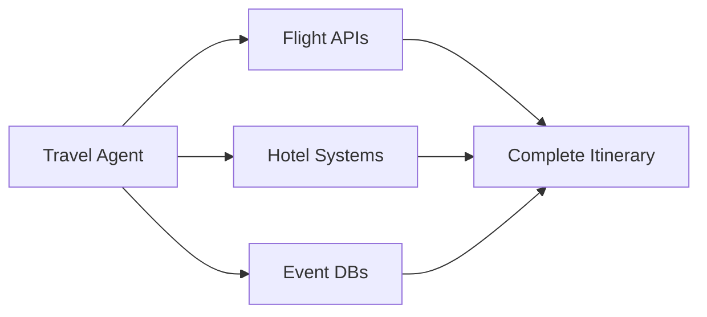

# 🤖 **INTRO TO AGENTIC AI** 

## 🌊 **Evolution of AI**

<table style="width:100%; border-collapse: collapse; margin: 20px 0;">
    <tr style="background: #e9ecef;">
        <th style="padding: 12px; text-align: left;">Wave</th>
        <th style="padding: 12px; text-align: left;">Focus</th>
        <th style="padding: 12px; text-align: left;">Key Action</th>
        <th style="padding: 12px; text-align: left;">Impact</th>
    </tr>
    <tr>
        <td style="padding: 12px; border-bottom: 1px solid #dee2e6;">📊 Predictive AI</td>
        <td style="padding: 12px; border-bottom: 1px solid #dee2e6;">Focus on analyzing data to predict outcomes.</td>
        <td style="padding: 12px; border-bottom: 1px solid #dee2e6;">Data Analysis</td>
        <td style="padding: 12px; border-bottom: 1px solid #dee2e6;">Enabled data-driven decisions</td>
    </tr>
    <tr>
        <td style="padding: 12px; border-bottom: 1px solid #dee2e6;">🎨 Generative AI</td>
        <td style="padding: 12px; border-bottom: 1px solid #dee2e6;">Creating content from data</td>
        <td style="padding: 12px; border-bottom: 1px solid #dee2e6;">Creating content (text, images, code, videos)</td>
        <td style="padding: 12px; border-bottom: 1px solid #dee2e6;">Empowered creativity and productivity.</td>
    </tr>
    <tr>
        <td style="padding: 12px;">🤖 Agentic AI</td>
        <td style="padding: 12px;">Focus on autonomous actions and learning iteratively.</td>
        <td style="padding: 12px;">Independent Operation</td>
        <td style="padding: 12px;">AI becomes proactive, managing complex tasks.</td>
    </tr>
</table>

## 🔄 **Comparison**

    

        <h3>Agentic AI</h3>
        <ul>
            <li>Performs tasks anonymously</li>
            <li>Analyzes data to make informed decisions</li>
            <li>Can tailor its technology to fit end goals</li>
        </ul>
    

    

        <h3>Generative AI</h3>
        <ul>
            <li>Requires human intervention</li>
            <li>Can only respond when given a prompt</li>
            <li>A better option for content creation</li>
        </ul>
    

## 🛠️ **Tool Calling in Agentic AI**

    <h3>Key Features</h3>
    <ul>
        <li>External tool integration</li>
        <li>Dynamic decision making</li>
        <li>Complex task handling</li>
        <li>Real-time adaptation</li>
    </ul>

### 🌟 **Example: Travel Planning Agent**

---

# 🚗 **Personalized Car Buying AI Agent**

## 🎯 **Vision**

    Transform online car shopping into an effortless, personalized, and highly efficient experience through advanced AI Agent.

## 💡 **Core Functionality**

    

        <h3>🗣️ Understanding User Needs</h3>
        
<strong>Conversational Interaction:</strong> The agent engages users in a dynamic conversation to gather detailed information about their car preferences, budget, desired features, and any specific requirements. This interactive approach goes beyond traditional forms, allowing for a more nuanced understanding of what the user truly wants.

        
<strong>Dynamic Requirement Analysis:</strong> Utilizing Large Language Models (LLMs), the agent interprets and refines user inputs in real-time, ensuring that the search criteria are accurately aligned with the user's needs.

    

    

        <h3>🎯 Filter Refinement</h3>
        
<strong>Customized Filtering:</strong> Unlike standard website filters, the AI agent creates highly specific and tailored search filters based on the user's detailed preferences. This level of customization ensures that the search results are more relevant and precisely match what the user is looking for.

        
<strong>Adaptive Criteria:</strong> As users interact with the agent, the filtering criteria can be adjusted and refined, allowing for a flexible and responsive search experience.

    

    

        <h3>📊 Data Gathering</h3>
        
<strong>Web Scraping Integration:</strong> The agent employs sophisticated web scraping tools, such as Python libraries like Playwright and lxml, to extract comprehensive data from platforms like AutoTrader. This includes essential details like titles, prices, mileage, and specifications.

        
<strong>Automated Browsing:</strong> By automating browser interactions, the agent efficiently navigates through multiple web pages, ensuring that all relevant listings are captured without manual intervention.

        
<strong>Database Integration:</strong> Alternatively, the agent can utilize a centralized database of car listings (e.g., CarZoomo). This approach enables faster querying and reduces reliance on real-time scraping, offering a more scalable and robust solution for data retrieval.

    

    

        <h3>📈 Smart Insights</h3>
        
<strong>Curated Listings:</strong> Instead of presenting users with an overwhelming number of listings, the agent offers a curated selection of top matches that best fit the user's criteria. This streamlined approach helps users focus on the most promising options.

        <ul>
            <li>Price Trends</li>
            <li>Comparative Recommendations</li>
            <li>Reliability of the Model</li>
            <li>Market Trends</li>
            <li>Common Issues</li>
        </ul>
    

## 🛠️ **Technologies**

    

        

            <h4>🧠 AI Core</h4>
            <ul>
                <li>LangGraph</li>
                <li>LangChain</li>
                <li>GPT-4o-mini</li>
            </ul>
        

        

            <h4>🌐 Web Tools</h4>
            <ul>
                <li>Playwright</li>
                <li>lxml</li>
                <li>CarZoomo API</li>
            </ul>
        

        

            <h4>💾 Storage</h4>
          
The agent interfaces with platforms like CarZoomo to fetch and present relevant listings or we can get data from database.

            <ul>
                <li>MongoDB</li>
                <li>Vector DB</li>
                <li>Cache systems</li>
            </ul>
        

    

## 📈 **Benefits**

    

        <h4>⏱️ Time Savings</h4>
        Automated search and evaluation process
    

    

        <h4>🎯 Personalization</h4>
        Tailored recommendations
    

    

        <h4>📊 Smart Insights</h4>
        Data-driven decisions
    

## ❓ **FAQs**

    

        
🔮 What's the future potential?

        
The Car Buying AI Agent is envisioned as an advanced digital assistant designed to revolutionize how users make purchasing decisions. Initially imagined to focus on car purchases from CarZoomo, it employs cutting-edge technologies such as LangGraph and Large Language Models (LLMs). Its potential lies in simplifying the decision-making process by dynamically understanding user preferences, optimizing filters, and delivering tailored recommendations.

    

    

        
🤔 How does it understand preferences?

        
The envisioned Agent would leverage LLM-driven interactions to engage users in a natural, conversational manner. Users could describe their ideal product, share their budget, and specify any unique requirements. The Agent would process this input to craft precise, personalized search criteria, transforming vague preferences into actionable insights.

    

    

        
⚙️ What's the core architecture?

        
<strong>User Input Processing:</strong> Utilizing conversational AI to understand and capture user preferences.

        
<strong>Dynamic Filter Refinement:</strong> Converting user inputs into optimized search filters suitable for target platforms.

        
<strong>Integrated Web Data Retrieval:</strong> Using advanced web scraping techniques to access and gather product data from online listings.

        
<strong>Summarization and Insights:</strong> Generating concise, insightful summaries to help users evaluate options at a glance.

    

